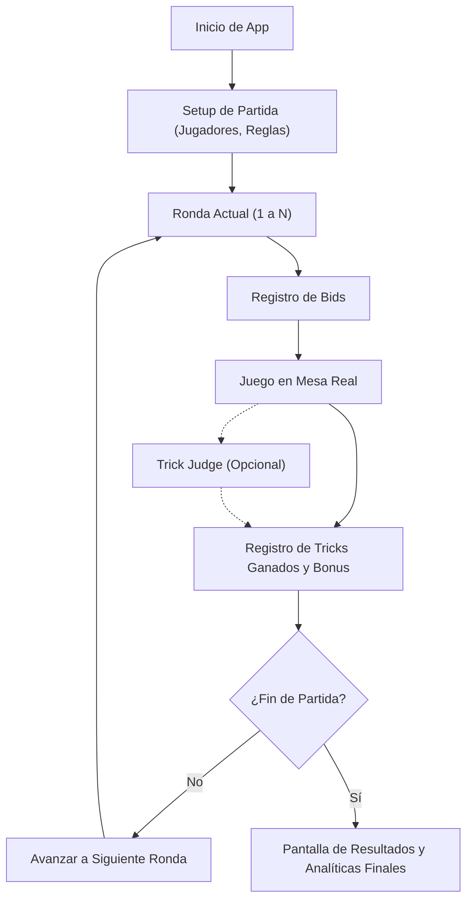

## 1. Descripción del Producto
Aplicación web premium llamada "Skull King Tracker" para llevar el registro de partidas del juego de cartas Skull King.
El objetivo principal es eliminar discusiones de mesa, reducir errores de cálculo y facilitar el recuerdo de bonuses y eventos especiales durante partidas reales. La aplicación debe ser extremadamente rápida, usable, orientada a grupos casuales y entusiastas, y estar optimizada para dispositivos móviles (mobile-first), funcionando también excelentemente en desktop.

## 2. Características Principales

### 2.1 Módulos de Funcionalidad
1. **Configuración de Partida (Setup)**: Creación de partida nueva, ingreso de jugadores, selección de presets de reglas (Standard, Rascal, Custom), cartas/expansiones opcionales (Kraken, White Whale, etc.) y número de rondas.
2. **Flujo de Partida**: Registro de apuestas (bids) de cada jugador, bazas ganadas (tricks) reales, bonus, cálculo de puntuación por ronda y visualización de puntuación acumulada. Validaciones de consistencia (ej. suma de bazas ganadas = posibles, salvo casos Kraken).
3. **Bonus y Reglas Especiales**:
   - Modo Simple: Ingreso de bonus manualmente.
   - Modo Asistido: Registro de eventos especiales por baza (ej. Mermaid capturando Skull King, Kraken anulando baza, White Whale neutralizando especiales).
4. **Juez de Bazas (Trick Resolver)**: Módulo opcional donde el usuario ingresa las cartas jugadas en orden y el sistema devuelve quién gana, por qué regla y posibles bonus.
5. **Historial y Analíticas**: Tabla de puntuaciones por ronda, resumen final, estadísticas destacadas (mayor cantidad de bids exactos, bids cero, etc.), exportación a JSON/CSV.

### 2.2 Detalles de Pantalla
| Nombre de Página | Nombre del Módulo | Descripción de la Funcionalidad |
|------------------|-------------------|---------------------------------|
| Inicio / Setup   | Configuración     | Ingreso de nombres, orden de turnos, ajustes de expansiones y reglas. |
| Partida Activa   | Flujo de Rondas   | Vista por ronda con inputs rápidos para bids y tricks. Visualización de score acumulado. |
| Juez de Bazas    | Resolución        | Selección de cartas jugadas y explicación del resultado de la baza. |
| Resultados       | Analíticas        | Tabla global, ranking final, timeline de eventos destacados. |

## 3. Proceso Principal

## 4. Diseño de Interfaz de Usuario
### 4.1 Estilo de Diseño
- Tema pirata pero elegante, maduro y no infantil ni kitsch.
- Alto contraste para visualización en entornos con poca luz.
- Tipografía distintiva para títulos y limpia para datos (ej. Lora / Playfair + Inter / Roboto).
- Modo oscuro (prioridad) y claro.
- Botones grandes y fáciles de tocar, minimizando la necesidad de escribir números (botones +/- rápidos).
- Estados vacíos, skeletons y mensajes de validación claros y no bloqueantes.

### 4.2 Resumen de Diseño de Página
| Nombre de Página | Nombre del Módulo | Elementos de UI |
|------------------|-------------------|-----------------|
| Partida Activa   | Panel de Jugador  | Tarjetas de jugador de alto contraste, botones +/- grandes, indicador de turno inicial. Sticky footer para "Finalizar Ronda". |

### 4.3 Responsividad
Mobile-first estricto, diseñado para ser usado con una mano durante la partida. La interfaz en desktop mostrará los datos de forma más holgada, aprovechando el espacio para tablas de puntuación completas y estadísticas paralelas.
