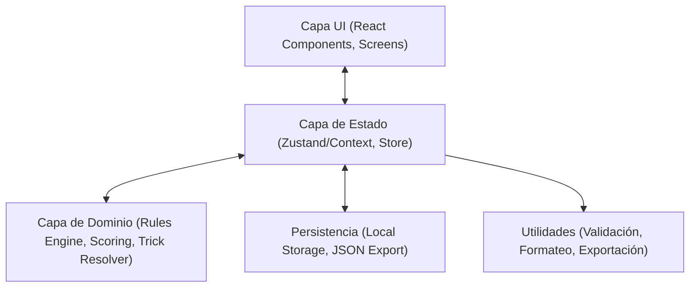
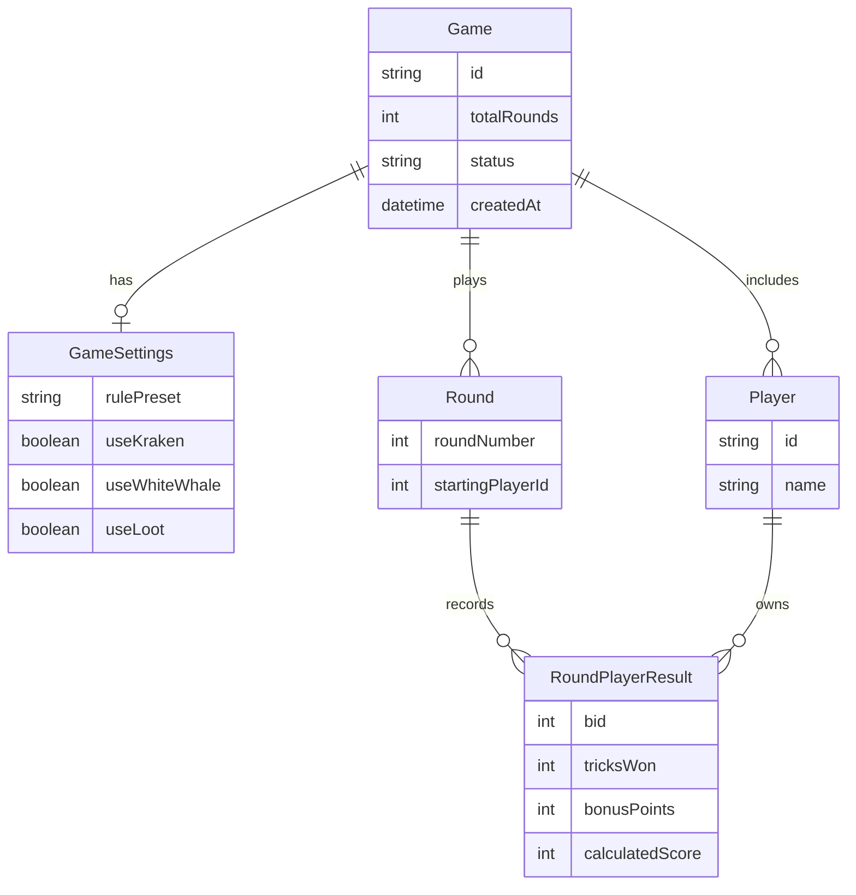

## 1. Diseño de Arquitectura
La aplicación web utilizará una arquitectura limpia de Frontend SPA sin backend tradicional (aplicación "static"), pero con lógica de dominio separada de la UI.

## 2. Descripción Tecnológica
- **Frontend**: React 18 + TypeScript + Vite.
- **Estilos**: Tailwind CSS v3 para un desarrollo rápido y responsivo. Lucide React para iconos.
- **Estado**: Zustand (o React Context) para manejar el estado de la partida, los jugadores y las configuraciones.
- **Motor de Reglas**: Funciones puras en TypeScript. Separación estricta entre UI y cálculos de puntuación.
- **Persistencia**: Local Storage con autosave y validación para evitar corrupciones.

## 3. Definiciones de Rutas
Dado que es una SPA de flujo continuo, no es estrictamente necesario un enrutador pesado (ej. react-router), pero el estado determinará la "pantalla" visible:
| Estado de Pantalla | Propósito |
|--------------------|-----------|
| /setup             | Configuración inicial (jugadores, expansiones, reglas) |
| /game              | Vista principal de la partida activa, dividida por rondas |
| /trick-judge       | Vista o modal de Juez de Bazas |
| /results           | Pantalla de resumen final y analíticas |

## 4. Definiciones de API
N/A (Aplicación frontend-only).

## 5. Modelo de Datos
El modelo de datos es explícito y estricto, para soportar validaciones y reglas complejas.

### 5.1 Definición del Modelo de Datos

### 5.2 Estructuras y Tipos Principales (Typescript)
Se implementarán tipos para `Player`, `GameSettings`, `Game`, `Round`, `RoundPlayerResult`, `TrickEvent`, `BonusEvent`, `CardPlayed`, `TrickResolution`, `ScoreBreakdown`.

## 6. Motor de Reglas y Puntuación (Rules Engine)
Se desarrollarán funciones puras:
- `calculateRoundScore(bid, tricksWon, bonus, settings)`
- `calculateGameTotals(game)`
- `validateRound(round, players, settings)`
- `resolveTrick(cardsPlayed, settings)`
- `explainTrickResult(resolution)`
- `serializeGame(game)`
- `deserializeGame(json)`

## 7. Pruebas y Calidad
- Pruebas unitarias para el motor de reglas (Scoring Básico, Zero Bids, Exact Bids, Bonus Manual, Resoluciones Complejas Mermaid/Skull King/Kraken/White Whale).
- Exportación e importación validadas.
